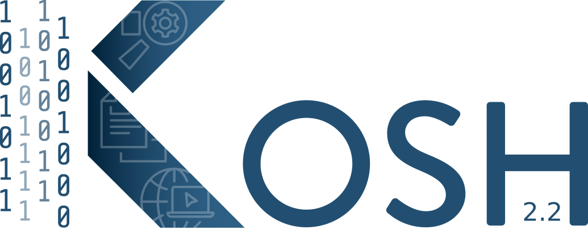

# WEAVE Tools

WEAVE provides a collections of tools to help you through your workflow.

These tools can be split in the following categories:

* Orchestration: split your workflow into separate and parametrizable steps
* Data Management: catalog, search and access your data
* Data Analysis: Sampling, UQ, Surrogate, etc...
* Data Visualization

## Tools description and links

### Workflow Orchestration

* {width="100" }: [LLNL GitLab](https://lc.llnl.gov/gitlab/weave/maestrowf) | [Public GitHub](https://github.com/LLNL/maestrowf/) | [Documentation](https://maestrowf.readthedocs.io/en/latest/) | [Presentation](https://lc.llnl.gov/confluence/download/attachments/715918180/Maestro_Weave_Kick_Off_2022.pptx?version=1&modificationDate=1649954551000&api=v2)
    *  Maestro is an open-source HPC software tool that defines a YAML-based study specification for defining multi-step workflows and automates execution of software flows on HPC resources. The core design tenants of Maestro focus on encouraging clear workflow communication and documentation, while making consistent execution easier to allow users to focus on science.

    * Maestro’s study specification helps users think about complex workflows in a step-wise, intent-oriented, manner that encourages modularity and tool reuse. Maestro’s development centers around a user-centric design approach and makes use of software design practices such as abstract interfacing and utilizing design patterns, forming the foundation of a vision for enabling a layered architecture to workflow tool design.

    * These principles are becoming increasingly important as computational science is continuously more present in scientific fields and users continue to perform increasingly complex workflow processes across platforms

* {width="100" }: [LLNL GitLab](https://lc.llnl.gov/gitlab/weave/merlin) | [Public GitHub](https://github.com/LLNL/merlin) | [Documentation](https://merlin.readthedocs.io/en/latest/) | [Presentation](https://lc.llnl.gov/confluence/download/attachments/715918180/merlin_overview_short_202204.pptx?version=1&modificationDate=1649947073000&api=v2)
    * Merlin is a tool for running machine learning based workflows. The goal of Merlin is to make it easy to build, run, and process the kinds of large scale HPC workflows needed for cognitive simulation.

    * At its heart, Merlin is a distributed task queuing system, designed to allow complex HPC workflows to scale to large numbers of simulations (we've done 100 Million on the Sierra Supercomputer).

    * Why would you want to run that many simulations? To become your own Big Data generator.

    * Data sets of this size can be large enough to train deep neural networks that can mimic your HPC application, to be used for such things as design optimization, uncertainty quantification and statistical experimental inference. Merlin's been used to study inertial confinement fusion, extreme ultraviolet light generation, structural mechanics and atomic physics, to name a few.

    * Ensemble manager.

### Data Management

* **Sina**: [LLNL GitLab](https://lc.llnl.gov/gitlab/siboka/Sina) | [Public GitHub](https://github.com/LLNL/Sina) | [Documentation - Internal](https://lc.llnl.gov/weave/Sina/html/index.html) | [Presentation](https://lc.llnl.gov/confluence/display/WEAV/Sina+WEAVE+ppt)
    * Sina allows codes to store, query, and visualize their data through an easy-to-use Python API. Data that fits its recognized schema can be ingested into one or more supported backends
    * Sina's API is independent of backend and gives users the benefits of a database without requiring knowledge of one, allowing queries to be expressed in pure Python. Visualizations are also provided through Python--see the examples folder for demo Jupyter notebooks.
    * Sina is intended especially for use with run metadata, allowing users to easily and efficiently find simulation runs that match some criteria.
    * Sina's code comes in two parts. The "cpp" component is an API for use in C++ codes that allows them to write data in Sina's recognized format. The remainder of Sina is found in the "python" directory, and includes all the functionality for handling and ingesting data, visualizing it through Jupyter, etc.

* {width="100" }: [LLNL GitLab](https://lc.llnl.gov/gitlab/ASCAML/kosh) | [Public GitHub](https://github.com/LLNL/kosh) | [Documentation](https://kosh.readthedocs.io/en/latest/) | [Presentation](https://doellnl-my.sharepoint.com/:p:/g/personal/doutriaux1_llnl_gov/EaSU4SQ1nJZDpVyWLPL8WSUBjlr6f2HIMRUsXfZxUKIArw?e=doGzrc)
    * Kosh allows codes to store, query, share data via an easy-to-use Python API. Kosh lies on top of Sina and as a result can use any database backend supported by Sina.
    * In addition Kosh aims to make data access and sharing as simple as possible.
    * Via "loaders", "transformers" and "operators" Kosh can access and process data in a consistent fashion, decoupled from data format and location.
    * Kosh is a Hindi word that means treasury, which is derived from Kosha, a Sanskrit word that means container in either a direct or metaphorical sense. A fairly good translation would be repository.

### Data Analysis

* {width=100} | [LLNL GitLab](https://lc.llnl.gov/gitlab/weave/trata) | [Documentation - Internal](https://lc.llnl.gov/weave/trata/html/index.html)
    * In creating a surrogate model, generating initial training data requires the selection of samples from the design parameter spaces. Trata is used to generate sample points in order to explore a parameter space.
    * For instance, if a simulation takes two inputs, x and y, and you want to run a set of simulations with x-values between 5 and 20 and y-values between 0.1 and 1000, the sampling component can generate sample points (in this case (x,y) pairs) for you.
    * You can specify how many total sample points you want, and how you want them to be chosen--Trata offers a large number of different sampling strategies. If, on the other hand, you already have sample points you wish to use, Trata can simply read them in from a file

* {width=100} **IBIS** | [LLNL GitLab](https://lc.llnl.gov/gitlab/weave/ibis)) | [Documentation - Internal](https://lc.llnl.gov/weave/ibis/html/index.html)
    * LLNL's Interactive Bayesian Inference and Sensitivity, or IBIS, is designed to be used after a number of simulations have run to completion, to predict the results of future simulation runs.
    * Assessment of system performance variation induced by uncertain parameter values is referred to as uncertainty quantification (UQ). Typically, the Monte Carlo method is used to perform UQ by assigning probability distributions to uncertain input variables from which to draw samples in order to calculate corresponding output values using surrogate models. Based on the ensemble of output results, the output distribution should statistically describe the output's uncertainty.
    * Sensitivity analysis refers to the study of how uncertainty in the output of a mathematical model or system can be attributed to different sources of uncertainty in the inputs. In the data science space, sensitivity analysis is often called feature selection.

### Data Visualization

* **PyDv**: [LLNL GitLab](https://lc.llnl.gov/gitlab/weave/pydv) | [Public GitHub](https://github.com/LLNL/pydv) | [Documentation](https://pydv.readthedocs.io/en/latest/) | [Presentation](https://lc.llnl.gov/confluence/download/attachments/715918180/PyDV%20Weave%20Presentation.pptx?version=1&modificationDate=1649946113000&api=v2)
    * The Python Data Visualizer (PyDV) is a replacement for ULTRA writtern in python. PyDV allows the presentation, manipulation, and analysis of 1D data sets, i.e. (x,y) pairs. Presentation refers to the capability to display, and make hard copies of data plots. Manipulation refers to the capability to excerpt, shift, and scale data sets. Analysis refers to the capability to combine data sets in various ways to create new data sets.
    * The principal object with which PyDV works is the curve. A curve is an object which consists of an array of x values, an array of y values, a number of points (the length of the x and y arrays), and an ASCII label. PyDV operates on curves
    * One of PyDV major asset is its capability to work with curves with different time discretization. 

## Which WEAVE Tool Should I Use?

As seen above, there can be multiple tools under the same workflow categories that can be used to achieve your purpose. It can be a bit perplexing for a new user to decide which tool to use for their needs. Below is a short description of each tools' uses and strengths to help a user determine the suitability of using a particular WEAVE tool.

### Workflow Orchestration

#### Maestro

Maestro is WEAVE's de-facto orchestration tool and should cover most of your needs. It is the underlying orchestration engine used by Codepy. 

#### Merlin

Merlin is built on top of Maestro and is geared toward workflows that require 100,000s to 1,000,000s of simulations. It relies on a client/server model.

### Data Management

#### Sina

Sina allows for integration with the Physics code and dumps their metadata, files produced and curves in a common output format. These files can later be ingested into a catalog. Once in a catalog, Sina provides powerful tools to query its content.

#### Kosh

Kosh is a Python tool built on top of Sina. It allows the user to access and process data stored within or outside of the Sina catalog without worrying about their format or location. The data stays where it was generated in the format it was generated. But via `loaders` Kosh renders the access to the data location- and format-independent. In addition Kosh provides `transformers` and `operators` to further process and manipulate data from one or mutliple, possibly heterogenous, sources.
Kosh also provides tools to move the data around while preserving the store's integrity.

### Data Analysis

#### TRATA

Trata is a Bayesian sampling package designed to allow users to explore a parameter space by generating sample points. Once the simulation data is accesssible, users can either load their sample data or generate samples using various sampling methods. Users can parse tab or csv files and create a parameter object that represents discrete, discrete-ordered, or continuous samples. Other file types can also be parsed into parameter objects but users would need to write their own custom functions in order to do so. Users can also generate samples using various Bayesian methods such as Latin Hypercube sampling, Quasi-Random Number sampling, or one of 14 other sampling methods made available through Trata.

#### IBIS

The Interactive Bayesian Inference and Sensitivity (IBIS) tool is designed to allow users to generate statistical models after physics simulations have run to completion. These models can be used to predict the results of future simulation runs, and to perform sensitivity and UQ analyses.

### Data Visualization

There is only one WEAVE tool that falls exclusively under the Data Visualization category: PyDV. However, Sina has a growing set of visualization capabilities.

#### PyDV
The Python Data Visualizer (PyDV) is a replacement for ULTRA written in python. PyDV allows the presentation, manipulation, and analysis of 1D data sets, i.e. (x,y) pairs. Presentation refers to the capability to display, and make hard copies of data plots. Manipulation refers to the capability to excerpt, shift, and scale data sets. Analysis refers to the capability to combine data sets in various ways to create new data sets. The principal object with which PyDV works is the curve. A curve is an object which consists of an array of x values, an array of y values, a number of points (the length of the x and y arrays), and an ASCII label. PyDV operates on curves.

#### Sina

Sina offers a visualizer that creates matplotlib visualizations directly from Sina datastores. It includes an interactive mode for live configuration of data. At the moment the visualizer plots are: scatter plots, line plots, histograms, and surface plots.
